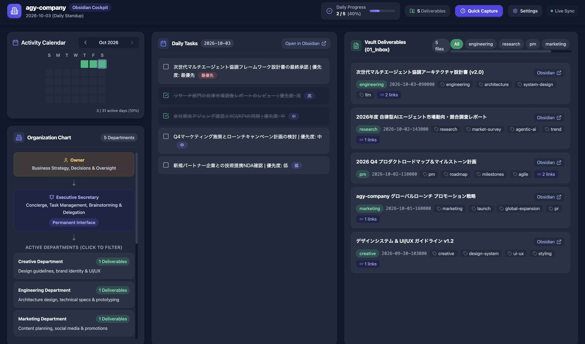

# agy-company

[English](./README.md) | [日本語](./README_JP.md)

[](https://github.com/)
[](https://obsidian.md/)
[](https://www.docker.com/)
[](https://opensource.org/licenses/MIT)

**agy-company** is a virtual organization management plugin for Google DeepMind's **Antigravity CLI (AGY)**, ported, redesigned, and enhanced from the concept of `cc-company` (originally designed for Claude Code).  
A dedicated **Executive Secretary** serves as your single primary interface—handling daily task tracking, brainstorming, quick note captures, and delegating complex workloads to specialized departmental subagents via `invoke_subagent`.

All deliverables are organized and persisted in a local **Obsidian Vault** (Markdown files), paired with a responsive, zero-cost **local Web Dashboard** for real-time visualization and management.




---

## 🌟 3 Core Design Principles

### 1. Unified Interface & Dynamic Department Spawning
```text
You (Owner) ────Dialogue────▶ Dedicated Executive Secretary
                                │
                                ├─ [Daily Tasks & Memos] ──▶ Immediately saved to Obsidian / Daily & Inbox
                                │
                                ├─ [Brainstorming] ────────▶ Refines ideas & creates meeting minutes
                                │
                                └─ [Specialized Tasks] ────▶ Spawns specialized subagents (invoke_subagent)
                                                             ├─ Research Dept (Market research, tech surveys)
                                                             ├─ Engineering Dept (Architecture, prototyping)
                                                             └─ PM Office (Milestones, task ticketing)
```
- **Start Small**: Begins with only the Secretary Office. No complex upfront organizational setup needed.
- **Natural Department Spawning**: When tasks in a domain occur 2 or more times, the Secretary proactively suggests establishing a dedicated department.
- **Secretary Persona & Language**: Easily customize tone and language at any time (Friendly Partner, Formal Butler, Casual Peer, Strict Coach, or Custom) in Japanese, English, or Bilingual mode.

### 2. 2-Tier Architecture: Git Workspace ⇄ Obsidian Vault
Maintains a strict separation to prevent in-flight scratchpads and raw logs from polluting your clean Obsidian knowledge base:

```text
【In-flight Scratchpad & Raw Logs】          【Clean, Final Deliverables Only】
Git-managed Repository (.company/)          Obsidian Vault (vault/)
├── AGENTS.md (Root Guidelines)             ├── 01_Inbox/ (Organized Deliverables)
├── secretary/ (Secretary Admin)            │   ├── research/ (Survey Reports)
│   ├── AGENTS.md (Persona Config)          │   ├── engineering/ (Tech Specs)
│   └── ...                                 │   └── ...
└── [department]/work/                      ├── 02_Daily/ (Daily Notes with nav links)
    └── (Drafts, raw data, logs)            └── AGENTS.md
```

### 3. Zero-API-Key Local Web Dashboard
A lightweight cockpit powered by FastAPI, React, and Tailwind CSS.
- **$0 LLM API Cost**: Reads and manipulates local Markdown files directly with zero LLM API consumption.
- **Responsive & Accessible**: Optimized for 4K and ultra-wide monitors, supporting seamless Japanese/English language switching, customizable font scaling, and live WebSocket updates.

---

## 📂 Directory Structure

```text
agy-company/
├── README.md                           # English Documentation (This file)
├── README_JP.md                        # Japanese Documentation
├── config/                             # Organization, department, and system settings (JSON)
│   ├── config.json                     # System common config (Vault path, default language)
│   ├── departments-ja.json             # Japanese organization, titles, and department definitions
│   └── departments-en.json             # English organization, titles, and department definitions
├── docker-compose.yml                  # Dashboard Docker Compose configuration
├── Dockerfile                          # Multi-stage container build (Frontend + Backend)
├── plugins/
│   └── company/                        # Antigravity CLI plugin bundle
│       ├── plugin.json                 # Plugin manifest
│       └── skills/
│           └── company/
│               ├── SKILL.md            # Workflow instructions and operating guidelines
│               └── references/
│                   ├── agents-md-template.md  # Template for AGENTS.md generation
│                   └── departments.md         # Default department definitions
├── dashboard/                          # Web dashboard source code
│   ├── backend/                        # FastAPI backend application
│   └── frontend/                       # React + Vite + Tailwind CSS frontend
├── .company/                           # Internal workspace & scratchpads (Git-tracked)
└── vault/                              # Obsidian Vault mount point (Final deliverables)
```

---

## 🚀 Installation & Activation

> **For detailed step-by-step setup instructions, please see [docs/INSTALLATION.md](./docs/INSTALLATION.md).**

Antigravity CLI automatically discovers plugins and skills from `.agents/` in your current working directory or `~/.gemini/config/`.

### 1. Workspace Setup
In your project root, create a symbolic link pointing to `plugins/company`:

```bash
mkdir -p .agents/plugins
ln -s "$(pwd)/plugins/company" .agents/plugins/company
```

### 2. Obsidian Vault Mount (Recommended)
To synchronize with Obsidian, bind-mount your dedicated Obsidian Vault (or subfolder) to `./vault`:

```bash
# Example: Mounting a dedicated 'company' folder from Google Drive / Obsidian Vault
sudo mount --bind "/path/to/Obsidian/MyVault/company" ./vault
```

> [!IMPORTANT]
> Always mount a dedicated subfolder (such as `company/`) rather than your entire personal Obsidian vault to prevent accidental modifications to personal notes.  
> If you don't use Obsidian, `./vault` works seamlessly as a standard local Markdown directory (leaving `./vault` empty is completely fine).

---

## 🤖 How to Use the Skill

### 1. Initial Onboarding (3-Minute Setup)
Type `/company` in Antigravity CLI chat:

```text
> /company
```
or
```text
> Hello secretary, please set up our company organization.
```

The Secretary will guide you through 4 interactive onboarding questions:
1. **Business & Activity**: What projects or business activities are you working on?
2. **Goals & Challenges**: What targets are you pursuing, and what bottlenecks do you want to automate?
3. **Daily Routine & Reminders**: Would you like scheduled morning check-ins? (Default: OFF)
4. **Secretary Persona & Language**: Choose your preferred communication tone and language (Japanese, English, or Bilingual).

Once answered, organizational structure files are generated and your dedicated secretary starts operations immediately.

---

### 2. Secretary Persona & Tone Customization 🎭

You can customize the secretary's tone, personality, or language at any time during work:

#### Commands & Prompt Examples:
```text
> /company tone
> Please switch secretary tone to Formal Butler
> Speak like a friendly startup co-founder
> Please speak in English
> Respond in bilingual Japanese/English
```

#### Available Persona Presets:
| Preset | Characteristics | Sample Phrasing |
|---|---|---|
| 🌟 **Friendly Partner** *(Default)* | Warm, positive, and collaborative | "Understood! I'll take care of that right away!" |
| 🎩 **Formal Butler** | Courteous, refined, and sophisticated | "Very well, sir/madam. I shall arrange this immediately." |
| 🤝 **Casual Peer** | Startup co-founder, concise peer | "Got it! On it! Let's ship this." |
| 🎯 **Strict Coach** | Disciplined, milestone-driven mentor | "Let's reverse-engineer our goal. Here is today's top priority." |
| 🎨 **Custom** | User-defined custom persona | Defined freely via your custom prompt. |

Configurations are persisted in `.company/secretary/AGENTS.md` and retained across sessions.

---

### 3. Daily Operations & Subagent Delegation

#### Daily Task Tracking
```text
> What are my TODOs for today?
> Add "Draft wireframes for new dashboard feature" to today's tasks
```
- Automatically recorded in `vault/02_Daily/YYYY-MM-DD.md` with bidirectional daily navigation links.

#### Quick Captures & Memos
```text
> Note down: "Explore local LLM code review automation tools"
```
- Timestamped Markdown notes are immediately saved to `vault/01_Inbox/`.

#### Delegating to Specialized Subagents (`invoke_subagent`)
```text
> Ask the research department to create a comparative performance report on modern open-source vector databases.
```
1. The Secretary invokes a specialized background subagent using `invoke_subagent`.
2. The subagent conducts intermediate research in `.company/research/work/` and delivers the polished final deliverable to `vault/01_Inbox/research/YYYY-MM-DD-HHmmss-VectorDB-Comparison.md`.
3. Standard YAML frontmatter (ID, aliases, tags, created/updated timestamps, and cross-note wiki links) is automatically populated.
4. The Secretary reviews the delivered file and presents an executive summary to you.
5. **Safety Guardrails**: Destructive repository-wide reset commands (`git reset --hard`, `git clean -fd`) are strictly prohibited; undos are scoped strictly to specific files (`git restore <path>`).

---

## 🖥️ Web Dashboard Guide

A built-in local dashboard is included to manage your Obsidian Vault graphically.

```bash
# Start dashboard container in background
docker compose up -d
```

Open **`http://localhost:18000`** in your web browser.  
*(Bound to localhost `127.0.0.1:18000:3000` to prevent unintended exposure to the local network).*


### Dashboard Panels & Features

#### ① Organization Chart Panel (Left Column)
- **Hierarchy Tree**: Displays Owner ➔ Secretary Office ➔ Active Departments.
- **1-Click Filtering**: Click any department card to filter the Deliverables list.
- **Vault Directory Tree**: Live directory view of `01_Inbox/` and `02_Daily/`.

#### ② Daily Tasks (Center Column)
- **Today's Tasks**: Parses `- [ ]` and `- [x]` items in `02_Daily/YYYY-MM-DD.md`.
- **Bidirectional Sync**: Toggling checkboxes on the UI updates the Markdown files in the vault immediately.

#### ③ Deliverables List (Right Column)
- **Latest Deliverables**: Browse deliverables published by subagents.
- **Obsidian Deep Linking**: Click "Obsidian" to open directly in the desktop Obsidian app via `obsidian://open?...` URI.
- **Markdown & Diagram Viewer**: Click any deliverable to open a rich modal supporting Markdown, Mermaid diagrams, and KaTeX math formulas.

#### ④ Quick Capture Modal
- Quickly jot down notes or ideas from the header button; saved with standardized YAML metadata in `01_Inbox/`.

#### ⑤ ⚙️ Settings Modal
- **Language Switcher**: Toggle between Japanese (JA) and English (EN) instantly.
- **Typography & Font Scaling**: Seamlessly scale root font size (14px–26px) with presets optimized for 4K screens (`16px`, `18.5px`, `21px`, `24px`).
- **Mermaid & Modal Sizing**: Configure minimum diagram heights and modal widths. Settings are stored in `localStorage`.

#### ⑥ Real-Time Synchronization (WebSocket)
- Automatically updates UI when files change in the Obsidian Vault.

---

## ⚙️ Customizing Organization & Departments (`config/` Directory)

You can freely define organization roles, department names, and descriptions by editing JSON files in the `config/` directory.

### 1. Configuration Files Overview

| File | Purpose | Main Settings |
|---|---|---|
| [`config/config.json`](./config/config.json) | Common System Settings | Vault path (`vault_dir`), Default language (`default_language`) |
| [`config/departments-ja.json`](./config/departments-ja.json) | Japanese Locale | Owner/Secretary titles and roles, Japanese department definitions |
| [`config/departments-en.json`](./config/departments-en.json) | English Locale | Owner/Secretary titles and roles, English department definitions |

### 2. Configuration Examples

#### ① Adding or Modifying Departments (`departments-ja.json` / `departments-en.json`)
Department keys (lowercase slugs) match the folder names under `vault/01_Inbox/`:

```json
{
  "departments": {
    "research": {
      "name": "Research Department",
      "role": "Market research, competitor analysis & technical surveys"
    },
    "legal": {
      "name": "Legal Department",
      "role": "Contract review, compliance & intellectual property"
    }
  }
}
```

> [!TIP]
> **Graceful Multi-Tier Fallback**:
> If you add a new department to `departments-en.json` but forget to add it to `departments-ja.json` (or vice-versa), the backend automatically falls back to the other language or generates a clean capitalized title from the folder name. The application will never crash due to missing keys.

#### ② Customizing Owner & Secretary Titles
Rename roles to fit your organizational model (e.g. CEO, Founder, Lead AI Agent):

```json
{
  "owner": {
    "title": "Chief Executive Officer (CEO)",
    "role": "Business Strategy, Decisions & Corporate Governance"
  },
  "secretary": {
    "title": "Lead AI Secretary",
    "role": "Concierge, task management, brainstorming & delegation",
    "permanent_badge": "Permanent Interface"
  }
}
```

---

### 3. 🐳 Docker Compose Runtime Behavior

`docker-compose.yml` mounts the host's `./config` directory into `/app/config` inside the container:

```yaml
    environment:
      - CONFIG_DIR=/app/config
    volumes:
      - ${CONFIG_PATH:-./config}:/app/config
```

#### Key Highlights:
- **Instant Hot-Reloading**:  
  When you modify and save `config/departments-en.json` or `config/departments-ja.json` on your host machine, **you do NOT need to restart (`docker compose restart`) or rebuild (`docker compose build`) the container**. Simply refreshing your browser immediately reflects the updated titles and department details.
- **Custom Config Directory Path**:  
  To point to a configuration directory located elsewhere, start Docker Compose with the `CONFIG_PATH` environment variable:
  ```bash
  CONFIG_PATH=/path/to/my-config docker compose up -d
  ```

---

## 🛠️ Troubleshooting & Tips

### Q. How do I update or rebuild the Docker container?
```bash
docker compose up -d --build
```

### Q. How do I change the default port (18000)?
Edit the `ports` mapping in `docker-compose.yml`:
```yaml
ports:
  - "127.0.0.1:YOUR_PORT:3000"
```

### Q. File change detection is delayed on Google Drive or WSL2
File polling is enabled by default in `docker-compose.yml`:
```yaml
environment:
  - WATCH_POLLING=true
```
This ensures reliable change detection across network drives and Windows WSL2 mount points.

### Q. How do I specify a custom Vault directory?
Set the `OBSIDIAN_VAULT_PATH` environment variable before running `docker compose up -d` (default: `./vault`):
```bash
OBSIDIAN_VAULT_PATH=/path/to/my/vault docker compose up -d
```
Alternatively, specify `OBSIDIAN_VAULT_PATH=/path/to/my/vault` in a `.env` file.

### Q. How do I specify a custom configuration (config/) directory?
Set the `CONFIG_PATH` environment variable before starting Docker Compose (default: `./config`):
```bash
CONFIG_PATH=/path/to/my-config docker compose up -d
```

---

## 🙏 Acknowledgments & Credits

This project was inspired by the design philosophy (starting small, centralized secretary interface, dynamic department spawning) of the Claude Code virtual organization plugin [**cc-company**](https://github.com/Shin-sibainu/cc-company) created by [@Shin-sibainu](https://github.com/Shin-sibainu) (MIT License).

We extended and re-architected this model natively for Google DeepMind's Antigravity CLI (AGY), adding native subagent delegation (`invoke_subagent`), Obsidian Vault integration, bilingual locale support, and a zero-cost local Web Dashboard. We express our deep appreciation to the original author for the pioneering concept.

---

## 📄 License & Third-Party Notices

This project is open-sourced under the **MIT License**.  
See [LICENSE](./LICENSE) for details. For AI assistance disclosures and third-party library licenses, please review [NOTICES.md](./NOTICES.md).
